# Canens

Break a goal into the next few actions.

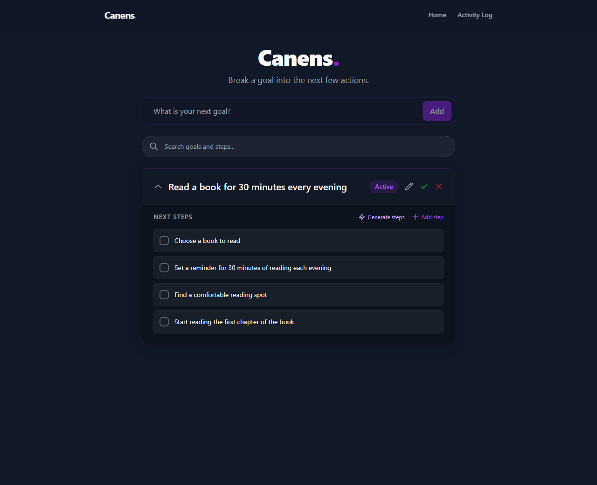

The browser holds the data. The server does the two things a browser cannot: it
calls Amazon Nova Lite, because a Bedrock credential cannot live in a bundle,
and it keeps a copy, because one copy in a browser profile is not a copy.

## What it does

You write a goal. The model proposes the next three to five actions. You keep the
ones you want, edit them, add your own, tick them off. Completing a goal archives
it to an Activity Log, and from there you can reopen it.

Every change is written to IndexedDB first and uploaded in the background. There
is nothing to sign in to and no account.

## Screens

The walkthrough below is not mock data. It is
[`web/tests/e2e/walkthrough.spec.ts`](web/tests/e2e/walkthrough.spec.ts) driving
a real browser against the deployed API, with real model calls, and it is
regenerated with `CANENS_SCREENSHOTS=1 npx playwright test walkthrough.spec.ts`.

**First run.** The onboarding offers to suggest goals, or you just type one.

| | |
| --- | --- |
| 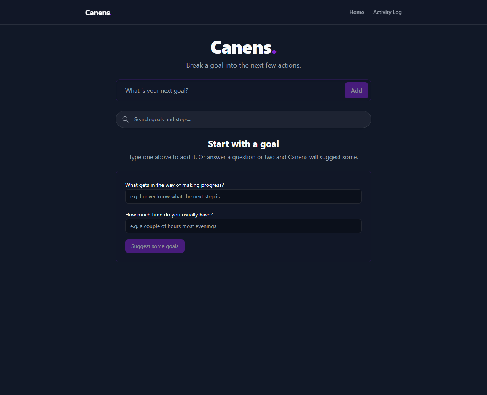 | 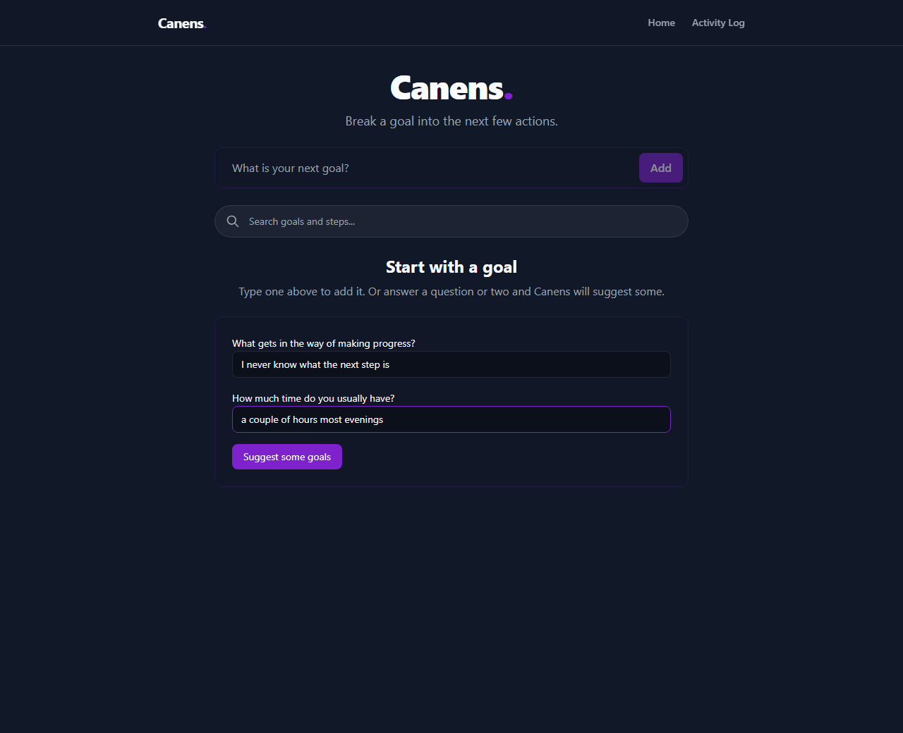 |
| An empty store, and the question. | Two answers, about to ask the model. |

**Suggestions.** Real output from Nova Lite.

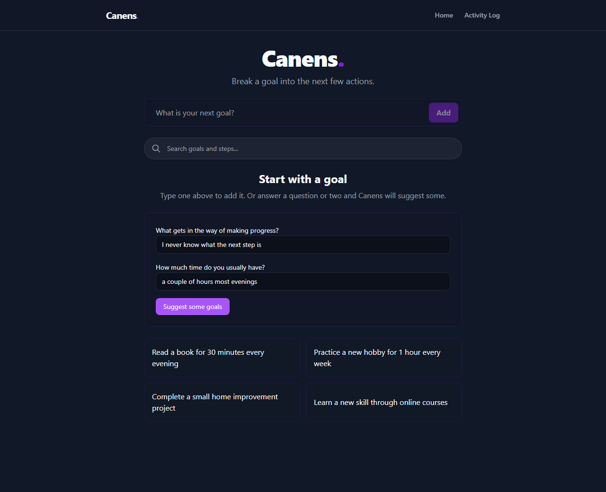

**Generated steps.** They are proposals. Nothing is saved until you accept them,
and they are appended rather than replacing what you already have.


**Alongside your own.** Type a step in the same list.

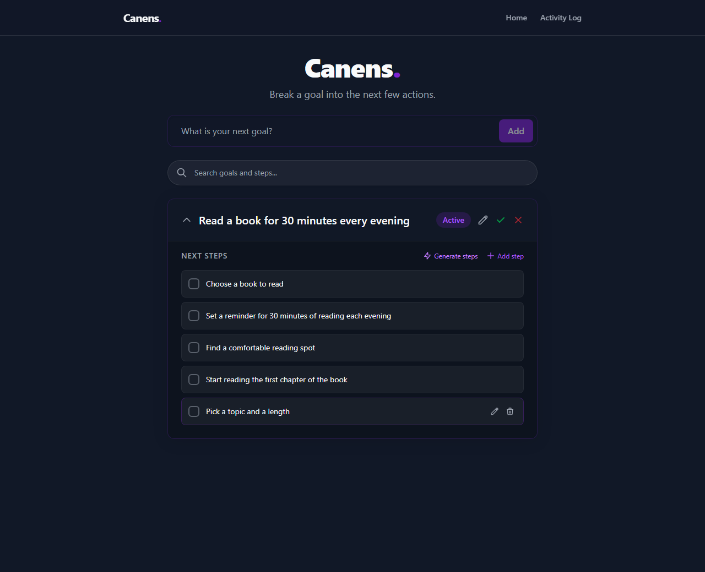

**Ticking one off.** It moves into a collapsed "completed" group.

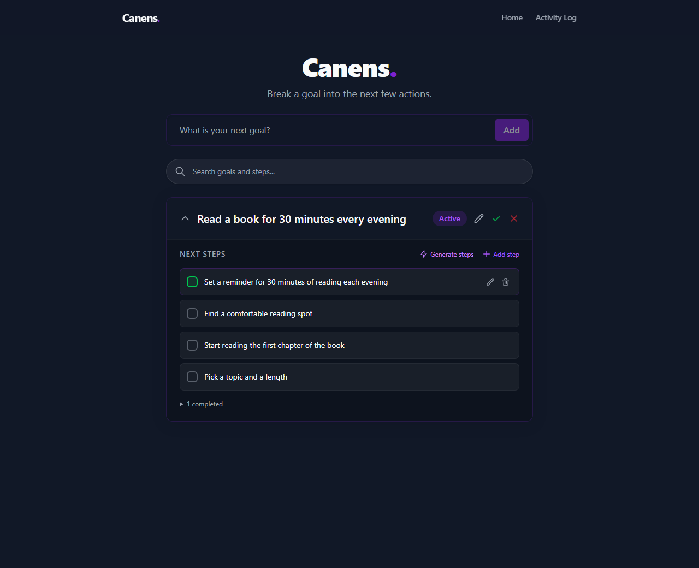

**Search still finds it.** This is the case that is easy to get wrong, so it is
the one worth a screenshot: a step you can no longer see still has to be
findable, so search covers completed steps as well as pending ones.

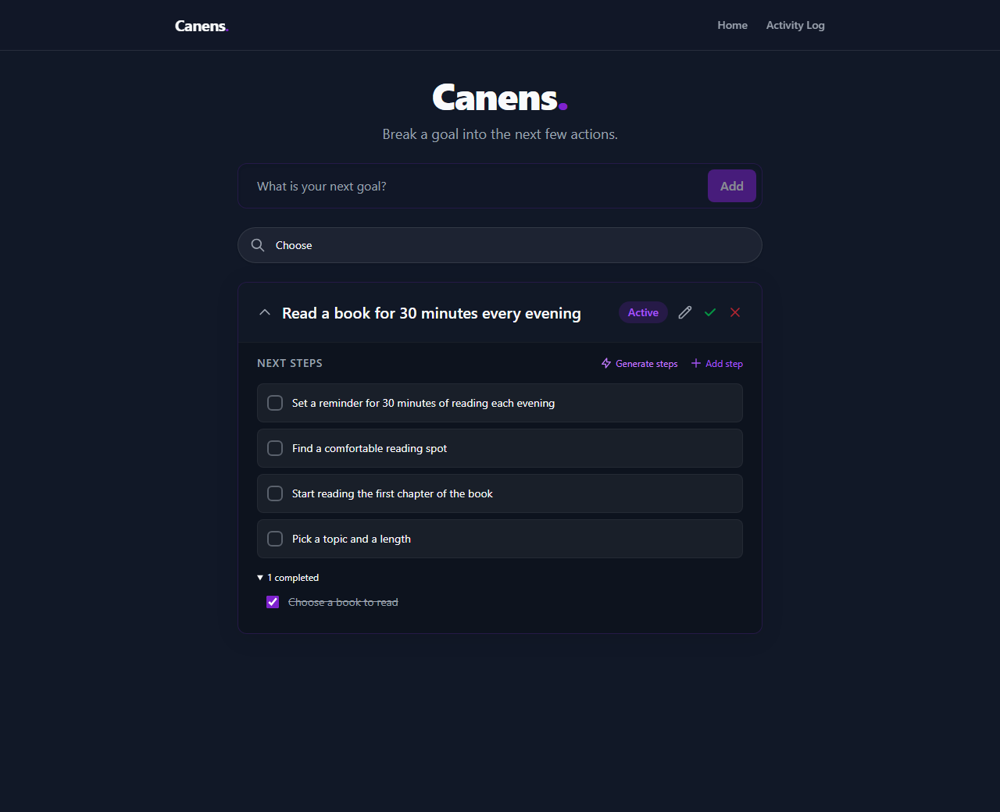

**Backup.** Every write is uploaded, and the status line says so. Failures are
reported here rather than swallowed.

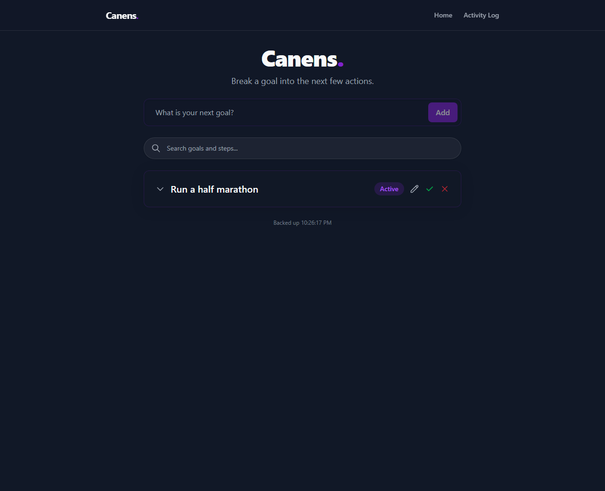

**Restore is asked for, not assumed.** If this browser has backed up before and
the store is empty, you emptied it on purpose, so it asks before resurrecting
anything.

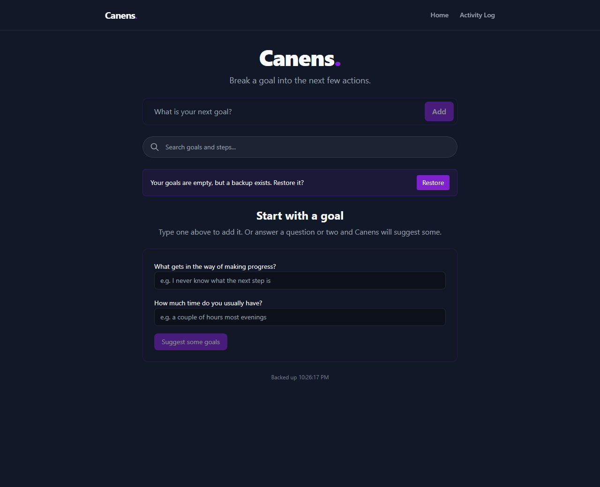

**Restore is automatic on a genuinely new device.** Losing the store *and* the
record that it had ever been backed up means there is nothing to suggest the
emptying was deliberate, so it restores on load.

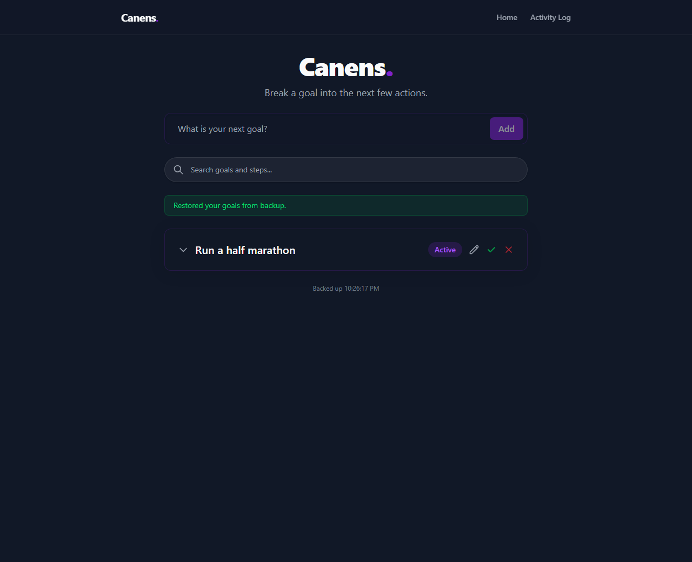

**Activity Log.** Where a completed goal stays reachable. Archiving is not a
one-way door.

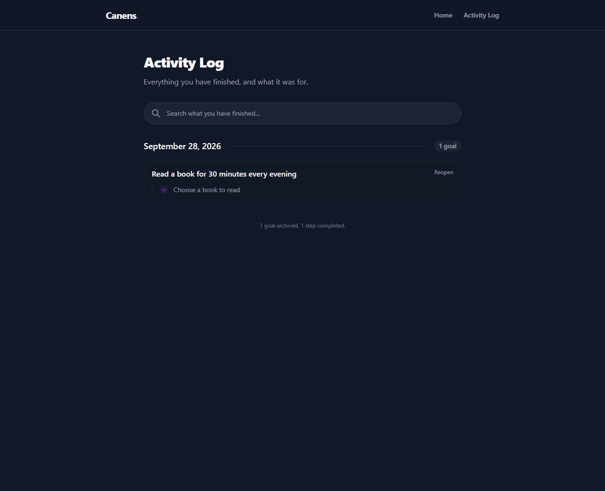

**Reopened.**

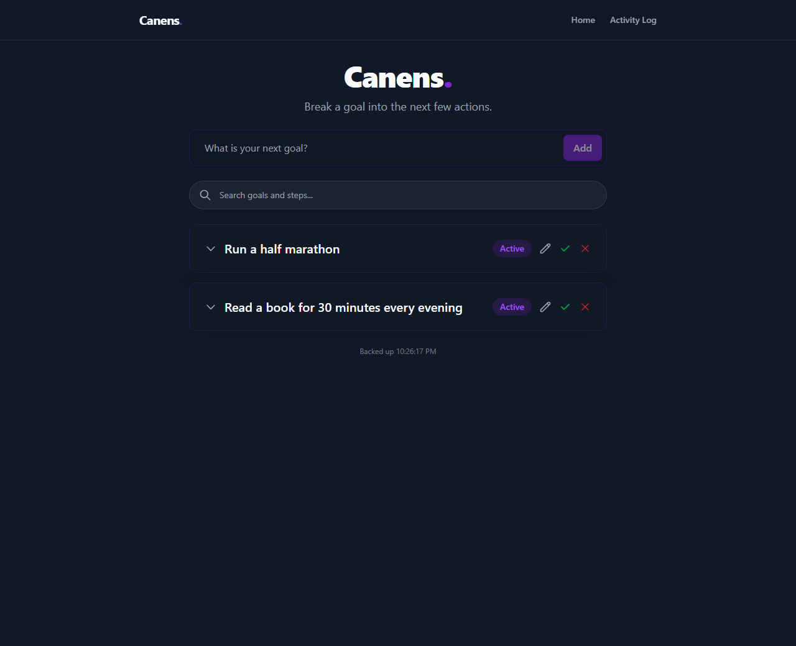

**On a phone.** Same markup, no separate build.

| | |
| --- | --- |
|  | 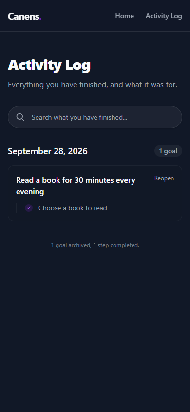 |

## Architecture

```
Browser                     API Gateway            Lambda
─────────                   ────────────           ──────
Next.js static export   →   HTTP API          →    FastAPI behind Mangum
Dexie / IndexedDB                                     │
    └── background upload ──────────────────────────→│
                                                       ├─→ S3        snapshot
      read model answer  ←───────────────────────────┤
                                                       └─→ DynamoDB  daily call counter
                                                            → Bedrock  Nova Lite
```

The frontend is a static export. There is no server-rendering, no API to hydrate,
and nothing to run but a CDN.

The backend is three functions and a table, and the shape follows from what it
actually has to do:

- **The model proxy.** It asks for a tool call rather than prose, so the input
  schema of the tool is the response schema and the output is shape-checked
  instead of parsed. It never writes a goal or a step.
- **The snapshot.** One JSON object per user in S3, overwritten on each upload.
  The client owns the data; this is a copy, not a sync, so there is no merge and
  therefore no conflict to get wrong.
- **The call counter.** One DynamoDB item per user per day, incremented under a
  condition and removed by TTL.

There is no database and no VPC. Nothing here is relational, so a relational
engine would be paying for features nothing uses, and nothing needs to be inside
a VPC, so the function has a public IP and reaches AWS directly. That is worth
about $0.02 a month. It was not always true: with Postgres on RDS the function
had to be in a VPC, and a Lambda in a VPC cannot reach the internet without a
NAT gateway (~$33/month) or a private endpoint (~$7/month). The reasoning is in
[`infrastructure/README.md`](infrastructure/README.md) because none of it is
obvious from the template.

### Keeping the bill bounded

The endpoint is public, so the cap is the real control:

- `AI_DAILY_CAP` (200 by default), enforced by a conditional DynamoDB update, so
  it holds when two requests arrive at once. It cannot live in the process:
  Lambda discards its execution environments, so an in-process counter resets to
  zero whenever a container is replaced — which looks like a working ceiling and
  is not one.
- `BEDROCK_MAX_TOKENS` per call, and generation is user-initiated only.
- API Gateway throttling at 5 requests/second, burst 10.
- A budget alarm at 80% of $5/month.
- `APP_ENV=production` makes `API_TOKEN` mandatory, so a deployment that forgets
  it fails at startup rather than quietly serving an unauthenticated billable
  endpoint.

`API_TOKEN` is not authentication. It ships in the public bundle, so anyone who
can load the page has it. It slows down casual abuse; the cap is what bounds
spend.

## Running it

No database to start. The snapshot is an object in S3 and the counter is an item
in DynamoDB, both reached with the credentials in your AWS profile.

```bash
cd backend
cp .env.example .env         # point SNAPSHOT_BUCKET and USAGE_TABLE at buckets you own
uvicorn app.main:app --reload # http://localhost:8000
```

```bash
cd web
cp .env.example .env.local   # optional; defaults to localhost:8000
npm install
npm run dev                  # http://localhost:3000
```

## Checks

```bash
cd backend && python -m pytest      # no database, no AWS account needed
cd web && npm test && npm run test:e2e
```

The backend fakes the two AWS clients at the boto3 boundary and validates the
parameters it is handed. A fake that accepted a bare integer where DynamoDB
wants a string is how a suite of 81 tests passed while the deployed function
could not count anything at all. Set `CANENS_TEST=1` to run against real AWS.

`verify.ps1` runs everything including the two passes CI skips — a live backend
and real model calls, which cost money.

```bash
powershell -File verify.ps1 -SkipAI
```

## Deploying

`web/` goes to GitHub Pages. The workflow needs three repository variables:
`NEXT_PUBLIC_API_URL`, `NEXT_PUBLIC_API_TOKEN` and `NEXT_PUBLIC_BASE_PATH`, all
inlined at build time. It fails rather than shipping a page pointing at
`localhost`.

`backend/` is a SAM stack:

```bash
sam build --template-file infrastructure/template.yaml
sam deploy --config-file infrastructure/samconfig.toml \
  --resolve-image-repos --resolve-s3 \
  --parameter-overrides ApiToken="$API_TOKEN" AlertEmail=you@example.com
```

No migration step, because there is no schema. See
[`infrastructure/README.md`](infrastructure/README.md).

## Sharp edges

Four things that cost time, kept here so they do not cost it twice.

- **A container image cannot name a Python attribute in `CMD`.** Lambda runs
  `CMD` as a program, so `CMD ["app.lambda_handler.handler"]` fails every
  invocation with `Runtime.InvalidEntrypoint`. The image runs the Runtime
  Interface Client: `python -m awslambdaric app.lambda_handler.handler`. Nothing
  but a test can catch this, so one reads the Dockerfile.
- **S3 returns `403`, not `404`, for a missing key** when the caller cannot list
  the bucket. Without `s3:ListBucket` the app reports "you have no backup" to a
  user who does — and the client auto-restores on that answer. The grant is
  scoped to the one prefix.
- **A named API Gateway stage breaks routing.** It prepends the stage name to
  the path the function receives, so the greedy route hands Mangum
  `/prod/api/health` and everything 404s in FastAPI. The stage is `$default`.
- **`CORSConfiguration` needs a list, not a comma-separated string.** API
  Gateway matches origins by exact string, so one element of `"a,b"` matches
  neither, and the preflight returns with no `Access-Control-Allow-Origin` at
  all. The parameter is `CommaDelimitedList`.

## Layout

| Path | |
| --- | --- |
| `web/` | Next.js static export. Dexie over IndexedDB is the store. |
| `backend/` | FastAPI. Four routes: health, two model calls, snapshot. |
| `infrastructure/` | SAM template, and why the network is shaped as it is. |
| `web/tests/e2e/walkthrough.spec.ts` | Regenerates the screenshots above. |
| `verify.ps1` | Everything, including the billable passes. |
